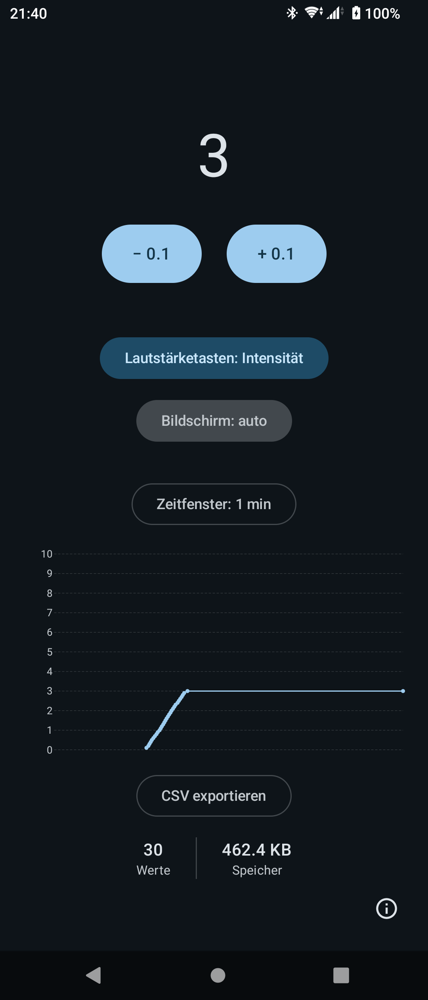

# Flowscale

[](https://github.com/schneeregenflocke/flowscale/actions/workflows/ci.yml) [](LICENSE)

> **Note:** this app gets developed by vibe coding.

An Android app (APK): a continuous, visual numeric rating scale (NRS) as a patient-reported outcome measure (PROM). Its interface is German.

## Purpose

### Screenshots

<p align="center">
  
</p>

### Features

- Record the intensity through the plus and minus buttons or the volume rocker
- A history chart with a configurable time window (1 to 120 min)
- CSV export of the collected data points
- The option "keep the screen on" for longer measuring sessions
- Local storage in Room and SQLite, no network access

#### Dependency licences

The [AboutLibraries](https://github.com/mikepenz/AboutLibraries) plugin generates the full list of every bundled third-party licence, and the app shows it under the info button (bottom right) → **Open-Source-Lizenzen**. Export the definitions by hand:

```sh
./gradlew :app:exportLibraryDefinitions
```

#### Licence

Flowscale stands under the [MIT licence](LICENSE) — copyright © 2026 Marco Peyer. See [NOTICE](NOTICE) for the third-party licences.

## Operations

### Build

#### Prerequisites

- JDK 17 to 21 — JDK 26 (the Arch default) is unsupported
- Android SDK platform 36, build tools matching the SDK
- The Gradle wrapper — shipped along, `./gradlew`

Android Gradle Plugin 9.1 is released for JDK 17 to 21. Set `JAVA_HOME` accordingly:

```sh
export JAVA_HOME=/usr/lib/jvm/java-21-openjdk
```

The Android SDK gets configured through `ANDROID_HOME` (`~/Android/Sdk` for instance) and per host in `local.properties` (`sdk.dir=…`, gitignored).

#### Building the debug APK

```sh
./gradlew assembleDebug
```

The APK then sits under `app/build/outputs/apk/debug/app-debug.apk`.

#### Tests

```sh
./gradlew testDebugUnitTest          # unit tests
./gradlew connectedDebugAndroidTest  # instrumentation tests (a device or emulator is needed)
```
